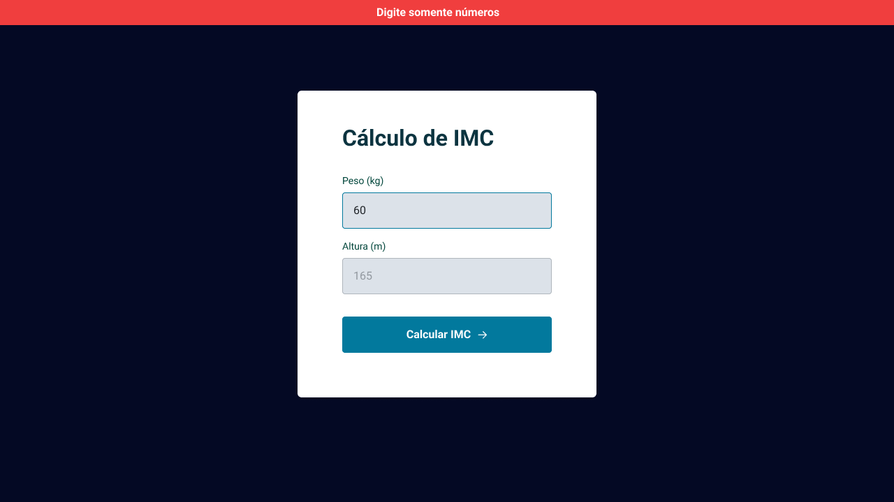

  

## 🖥️ Projeto

Esse é um projeto Web para calcular o IMC.

## 🚀 Tecnologias

Esse projeto foi desenvolvido durante o curso Explorer da Rocketseat (stage 5) com as seguintes tecnologias:

- HTML
- CSS
- JavaScript
- Git e Github

## 🏷️ LAYOUT

Você pode visualizar o layout do projeto através
[desse link](<https://www.figma.com/file/IYTbZQLrh0JknmOIwKqaK6/IMC-(Copy)?type=design&node-id=108-2&t=TualEyfJbHik4a7K-0>).
É necessário ter uma conta no [Figma](https://www.figma.com).